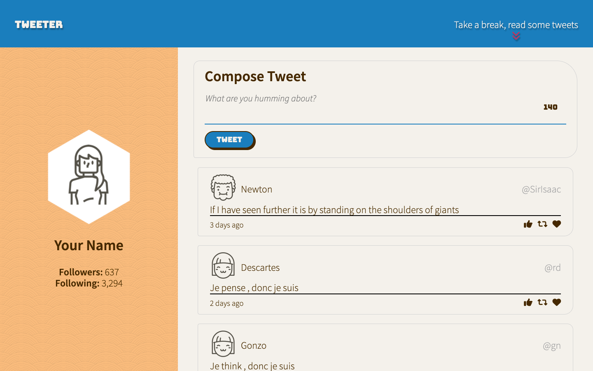
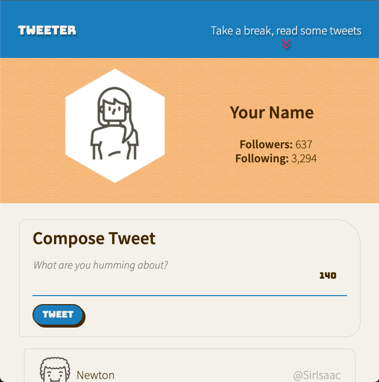
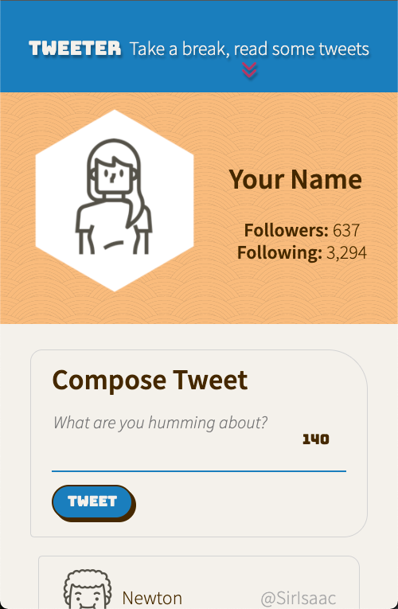
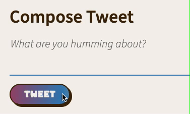
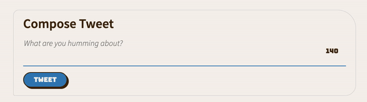
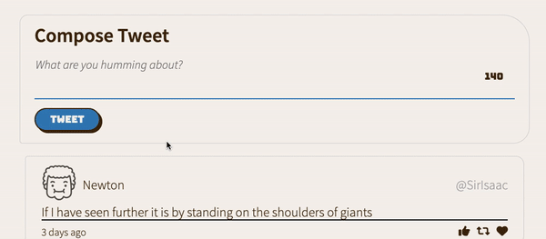

# Tweeter Project

Tweeter is a simple, single-page Twitter clone.

## Objectives

- use jQuery as much as possible when manipulating DOM elements
- implement CSS transitions and animations, both with raw CSS and with jQuery
- sanitize user input to protect against cross-site scripting
- implement error handling and user warnings

## Dependencies

- [Express](https://www.npmjs.com/package/express/)
- [Node.js](https://nodejs.org/en/) 5.10.x or above
- [body-parser](https://www.npmjs.com/package/body-parser/)
- [Chance](https://www.npmjs.com/package/chance)
- [MD5](https://www.npmjs.com/package/md5)

## Responsive Design
### Desktop 

### Tablet

### Mobile

## Animations
### Colour animation on button `:hover`

### Box shadow animation on `:hover`

### Error messages for bad input
